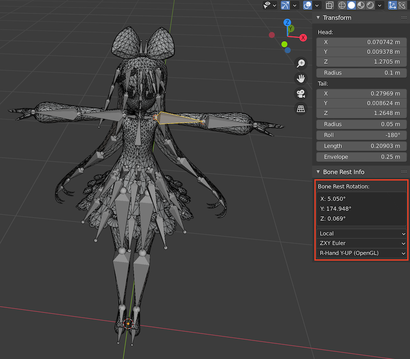
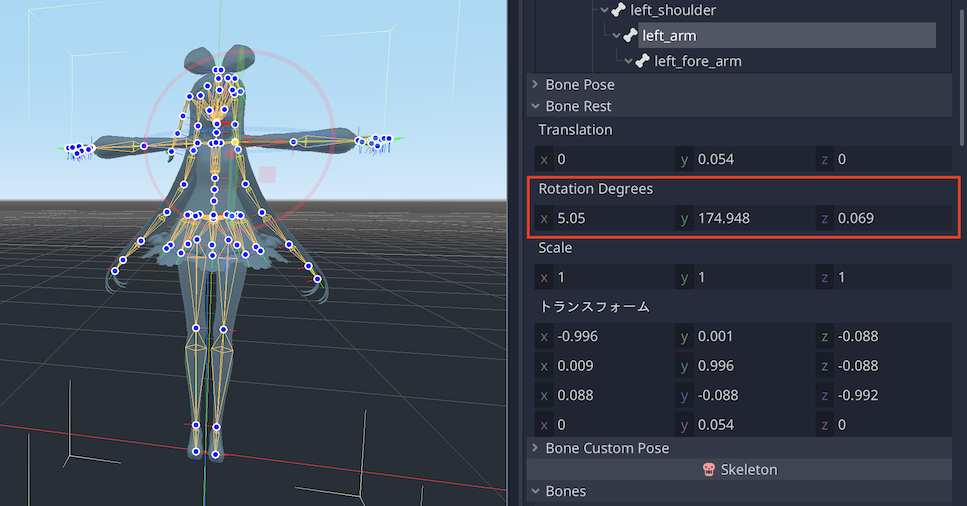

# Bone Rest Info

## Description

In the Node format, such as glTF, each joint has a rest rotation a.k.a. local axis direction.

Blender uses the Head-Tail format, so the rest rotation is determined from the two coordinates: Head and Tail, and the roll value.

However, Blender does not display this determined rest rotation. This add-on displays the rest rotation determined by Blender as a numerical value.

**Bone Rest in Blender**

**Bone Rest in Godot (Right-Handed Y-UP)**

## Update Log

### v1.0 (Mar 11, 2021):

- Release

## Note

Blender's `Quat -> XYZ Euler` works the same way as Godot's `Quat.get_euler_zyx()`. This **reversal of notation** is due to the fact that Blender notates the order of rotation in euler angles, while Godot notates the order of matrix processing.